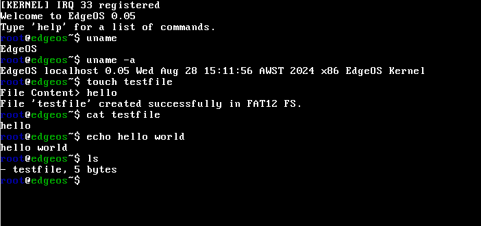

# EdgeOS
A tiny x86 OS kernel, including basic terminal

- No POSIX standard, not Unix-like.
- Hobbyist operating system kernel.
- ISO build support.
- Multi-boot support (GRUB bootloader).
- FAT12 basic file system.
- Basic I/O (file read/write). Terminal includes basic file creation, deletion, and writing commands.
- TTY Terminal (similar to bash).
- Entered x86 protected mode.
- Supports memory paging.
- Single-user root.
- Application includes: a text editor similar to VIM, a simple calculator.
- Kernel released under the MIT license; other licenses are noted in the respective code header comments.
