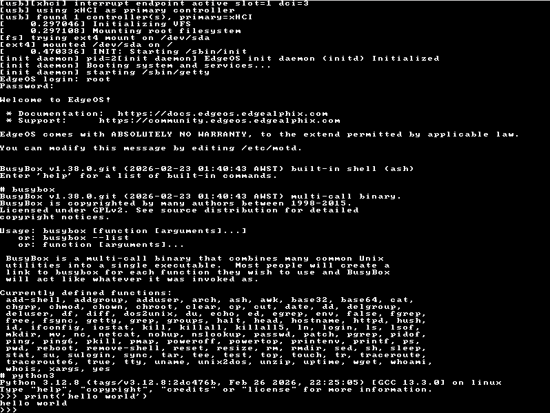
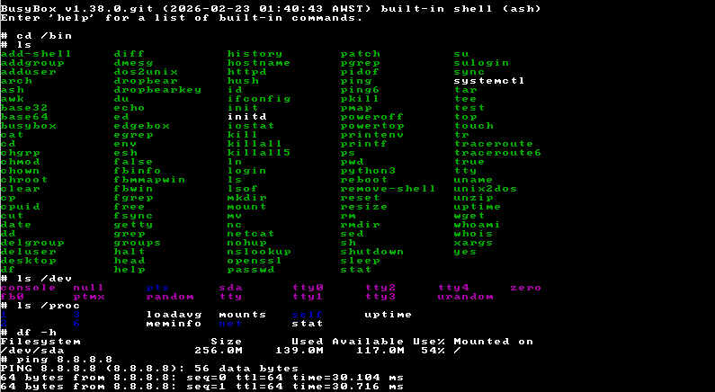
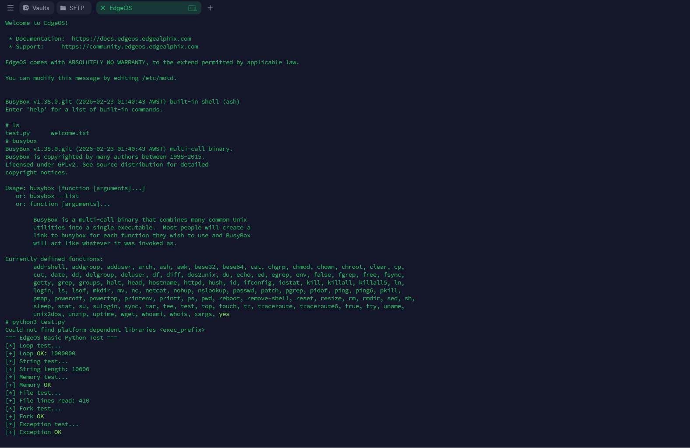
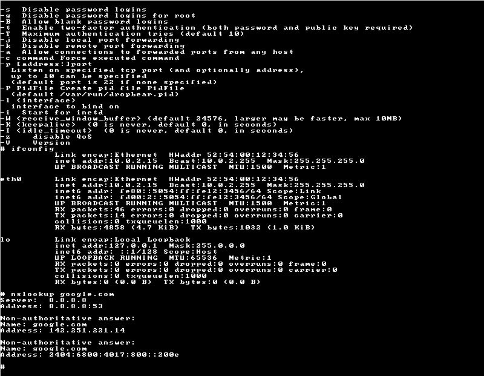

# EdgeOS

EdgeOS is a 64-bit Unix-like operating system with a native kernel, Linux-compatible syscall ABI layer, ELF process model, VFS subsystem, and a musl-based userspace environment.

The system is designed to run unmodified Linux userspace software built against musl libc by implementing Linux syscall semantics and kernel subsystem behavior where practical.

EdgeOS boots as a fully standalone operating system. It loads a native kernel, mounts an ext4 root filesystem, launches `/sbin/init`, starts `getty`, and provides a multi-user shell environment with networking, storage, and framebuffer support.

The project aims to provide a clean, understandable kernel architecture while maintaining strong compatibility with real-world Linux software.





------

# Core Architecture

EdgeOS is structured around a traditional Unix kernel design with clear separation between kernel space and user space.

The system includes:

• a monolithic 64-bit kernel
 • ring3 userspace isolation
 • Linux-style process model (`fork` / `exec`)
 • ELF executable loader
 • Linux-compatible syscall ABI
 • a virtual filesystem layer
 • a dynamically mounted root filesystem

The kernel implements enough of the Linux syscall interface to run real userspace software compiled for Linux + musl without modification.

This allows existing Linux programs such as BusyBox, Dropbear SSH, OpenSSL tools, and CPython to run directly on EdgeOS.

------

# Kernel Subsystems

EdgeOS implements a set of core kernel subsystems typical of modern Unix-like systems.

### Process and Execution

EdgeOS provides a Linux-style process lifecycle including:

- `fork`
- `execve`
- `wait`
- signals
- process groups
- session / login handling

Userspace processes run in ring3 with full kernel/userspace isolation.

The system boot sequence follows the traditional Unix model:

```
kernel
 → /sbin/init (PID 1)
 → getty
 → login
 → user shell
```

An init daemon handles orphan reaping and ensures PID 1 stability.

------

### Linux Syscall ABI Compatibility

EdgeOS implements a large subset of the Linux syscall ABI with matching semantics wherever possible.

The goal is to allow software built for **Linux + musl libc** to run without source modification.

Implemented syscall domains include:

- process management
- filesystem operations
- memory mapping
- networking
- device access
- signals
- polling and timing

Many modern Linux userspace applications already run successfully under EdgeOS using the musl toolchain.

------

### Filesystems

EdgeOS uses a VFS layer that supports multiple filesystem backends.

Current filesystem support includes:

- ext4 (primary root filesystem)
- ext2 (legacy compatibility)
- FAT32 (mountable external filesystem)
- procfs
- in-memory fallback filesystem

The root filesystem is normally an ext4 image generated by the build system.

Device nodes such as `/dev/null`, `/dev/random`, `/dev/tty`, `/dev/fb0`, and `/dev/sda` are provided.

------

### Storage

The kernel includes a block device subsystem supporting modern storage controllers.

Current drivers include:

- AHCI SATA controller
- ATA device support

This allows EdgeOS to boot from virtual disks and physical storage devices.

------

### Networking

Networking support is provided by a kernel-integrated lwIP stack.

Supported features include:

- IPv4
- IPv6
- ICMP / ICMPv6
- TCP
- UDP
- DNS resolution

The Intel e1000 driver provides Ethernet support.

Userspace networking tools such as `ifconfig`, `ping`, `wget`, `nc`, and `nslookup` operate normally.

------

### USB

The kernel includes a developing USB subsystem with support for:

- UHCI controllers
- xHCI controllers

USB HID devices such as keyboards and mice are supported in QEMU environments.

------

### Graphics

EdgeOS supports both text and graphical console environments.

Display backends include:

- VGA text console
- framebuffer console

Userspace programs can draw directly through `/dev/fb0`.

------

# Userspace Environment

EdgeOS ships with a minimal native userspace together with optional third-party software.

The base system includes utilities implemented in the repository.

These provide the essential functionality required for system boot and management.

If BusyBox is installed into the root filesystem, hundreds of standard Unix utilities become available automatically.

BusyBox runs unmodified and provides a complete POSIX-style command environment.

Supported BusyBox utilities include tools such as:

`ash`, `ls`, `cp`, `mv`, `rm`, `ps`, `top`, `ifconfig`, `ping`, `wget`, `tar`, `sed`, `grep`, and many others.

------

# Linux Userspace Compatibility

EdgeOS is capable of running a surprising amount of real Linux software.

Programs known to work include:

- BusyBox (full build)
- Dropbear SSH
- OpenSSL CLI tools
- CPython 3.12
- many musl-linked Linux utilities

These programs run without modification because the kernel implements the expected Linux syscall behavior.

------

# Boot Process

EdgeOS boots through the standard Multiboot2 boot flow using GRUB.

The boot process follows a traditional Unix layout:

```
GRUB
 → EdgeOS kernel
 → mount root filesystem
 → start /sbin/init
 → spawn getty
 → login shell
```

The system supports both LiveCD boot and disk boot.

------

# Build

EdgeOS builds entirely from source using the project Makefile.

```
make
```

The build produces:

- kernel image
- bootable ISO
- ext4 root filesystem
- userspace binaries

------

# Project Status

EdgeOS is an experimental operating system and not intended for production use.

However, the system already demonstrates:

- a complete Unix boot pipeline
- multi-user login
- Linux syscall ABI compatibility
- real userspace software support
- networking and SSH access
- persistent ext4 root filesystem

The project continues to evolve as a research platform for kernel development and Linux compatibility experimentation.

# Screenshots

Via SSH:



Network:



# License

EdgeOS is released under the Mozilla Public License 2.0.

The kernel source code in this repository is licensed under MPL-2.0. You are free to use, modify, and distribute EdgeOS, including as part of commercial or closed-source products.

If you modify files from the EdgeOS source code, the modified versions of those files must be made available under the same MPL-2.0 license when distributed.

Original copyright notices must be preserved.

For the full license text, see: 

https://licenses.opensource.ngo/docs/public-licenses/MPL-2.0

Third-party components included or built through the optional ports may use their own upstream licenses.

